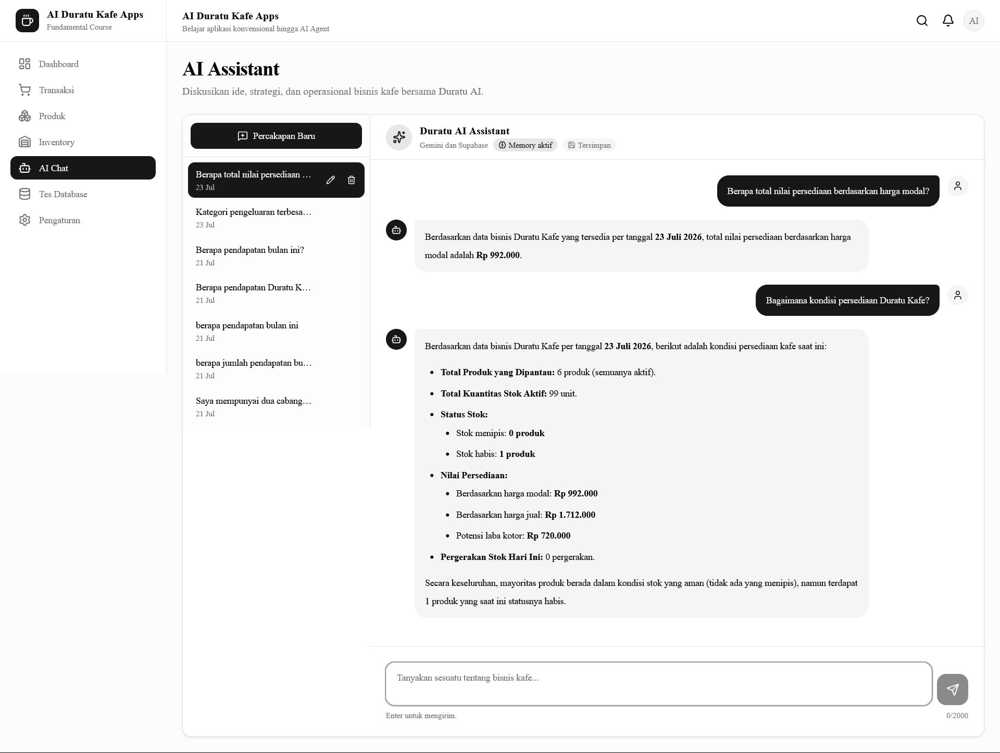
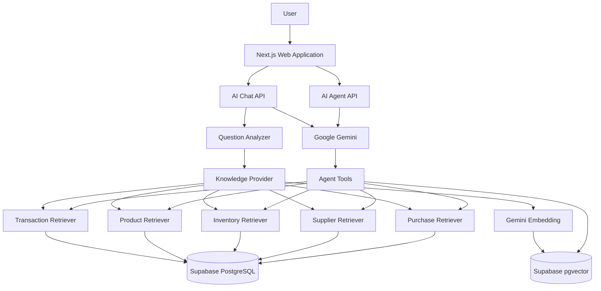

# ☕ Duratu Kafe — AI-Powered Apps

> From a conventional business application to an AI-powered
> business assistant using Gemini, RAG, Vector Search, and AI Agent.

## 🖥️ Application Preview

<div align="center">



<p>
  <em>Duratu AI Assistant analyzing real inventory data from the business system.</em>
</p>

</div>


## 📌 Overview

**Duratu Kafe** is an AI-powered business management application built as a learning and portfolio project to demonstrate how Artificial Intelligence can be integrated gradually into a real-world business application.

Instead of starting directly with an AI chatbot, this project begins with a conventional business application and gradually adds AI capabilities.

The development journey follows this progression:

```text
Conventional Business App
        ↓
CRUD + Database
        ↓
Gemini Integration
        ↓
AI Chat
        ↓
Streaming Response
        ↓
Markdown Rendering
        ↓
Business Data Grounding
        ↓
Simple RAG
        ↓
Vector RAG
        ↓
Read-Only AI Agent
```

The main principle of this project is:

> **AI explains and reasons, while the database remains the source of truth for business data.**

Financial figures, inventory quantities, product prices, supplier information, and purchase orders are retrieved from structured business data rather than generated by the LLM.

---

# 🎯 Project Goals

The project was created to learn and demonstrate:

- Full-stack application development with Next.js
- Business CRUD operations
- Supabase integration
- Relational business data modeling
- Gemini API integration
- AI chat interfaces
- Streaming AI responses
- Markdown rendering
- Structured business-data grounding
- Retrieval-Augmented Generation (RAG)
- Embedding generation
- Semantic vector search
- Supabase `pgvector`
- AI function/tool calling
- Read-only AI Agent architecture

The project intentionally avoids unnecessary complexity.

Technologies such as LangChain, LangGraph, multi-agent orchestration, or external vector databases are not introduced unless they solve a real problem.

---

# 🏪 Business Domain

Duratu Kafe represents a simplified café business management system.

The application manages several core business domains:

| Domain | Description |
|---|---|
| Transactions | Income, expenses, and financial transactions |
| Products | Product master data, prices, cost, and margin |
| Inventory | Stock levels and inventory monitoring |
| Suppliers | Supplier master data and contact information |
| Purchase Orders | Purchasing workflow and order status |
| Goods Receipts | Receiving goods from purchase orders |
| AI Knowledge Base | SOPs, policies, and operational guidelines |

---

# ✨ Key Features

## Conventional Business Features

- Dashboard
- Transaction management
- Product management
- Product categories
- Inventory monitoring
- Supplier management
- Purchase Orders
- Goods Receipts
- Financial summaries
- Search and filtering
- Business reporting

---

## AI Features

### 1. Gemini AI Integration

Gemini is integrated into the application to provide natural-language interaction with business information.

Example:

```text
User:
Bagaimana kondisi bisnis Duratu Kafe?

AI:
Provides an explanation based on available business context.
```

---

### 2. AI Chat

The application includes an AI chat interface where users can ask questions using natural language.

Examples:

```text
Berapa pendapatan bulan ini?

Berapa stok kopi saat ini?

Berapa harga Americano?

Siapa supplier yang aktif?

Tampilkan Purchase Order yang belum selesai.
```

---

### 3. Streaming Responses

AI responses can be streamed to the interface, providing a more natural chat experience.

```text
User Question
      ↓
API Route
      ↓
Gemini
      ↓
Streaming Response
      ↓
Chat Interface
```

---

### 4. Markdown Rendering

AI responses support Markdown formatting.

This allows the AI to return:

- headings
- lists
- emphasis
- structured explanations
- business summaries

---

# 🧠 Structured Business Data Grounding

One of the most important architectural decisions in this project is separating **LLM reasoning** from **business calculations**.

The LLM does not invent business numbers.

Structured business data comes directly from the application database.

```text
User Question
      ↓
Question Analyzer
      ↓
Business Domain Detection
      ↓
Retriever
      ↓
Supabase
      ↓
Context Builder
      ↓
Gemini
      ↓
Natural Language Answer
```

Examples of grounded questions:

```text
Berapa pendapatan bulan ini?

Berapa stok produk X?

Berapa harga jual Americano?

Berapa supplier aktif?

Purchase Order mana yang belum selesai?
```

The numbers returned by the AI originate from application data.

---

# 🧩 AI Business Domains

The AI layer currently understands several structured business domains.

| AI Domain | Data Source |
|---|---|
| Transaction AI | Transaction data |
| Product AI | Product master data |
| Inventory AI | Inventory data |
| Supplier AI | Supplier data |
| Purchase AI | Purchase Order data |

Each domain generally follows:

```text
Question
   ↓
Analyzer
   ↓
Retriever
   ↓
Context Builder
   ↓
Gemini
```

---

# 💰 Transaction AI

Transaction AI handles financial and transaction-related questions.

Example questions:

```text
Berapa pendapatan bulan ini?

Berapa jumlah transaksi hari ini?

Bagaimana kondisi keuangan bulan ini?

Berapa total pengeluaran?
```

The AI does not calculate financial numbers independently.

Transaction values are retrieved from the business data layer.

---

# 📦 Inventory AI

Inventory AI handles stock-related questions.

Examples:

```text
Berapa stok kopi?

Produk apa yang stoknya menipis?

Produk mana yang stoknya habis?

Apakah ada produk yang perlu direstock?
```

Inventory is intentionally separated from Product AI.

This prevents questions about product prices and questions about stock quantities from being mixed into the same domain.

---

# 🛍️ Product AI

Product AI handles product master information.

Examples:

```text
Berapa harga Americano?

Berapa harga modal Americano?

Berapa margin Americano?

Apa SKU Americano?

Tampilkan produk aktif.

Tampilkan produk kategori kopi.
```

Typical product information includes:

```text
Product Name
SKU
Category
Description
Unit
Cost Price
Selling Price
Gross Margin
Product Status
```

---

# 🚚 Supplier AI

Supplier AI handles supplier information.

Examples:

```text
Berapa supplier aktif?

Siapa supplier PT Sumber Kopi Nusantara?

Berapa nomor telepon supplier X?

Apa email supplier X?

Tampilkan supplier tidak aktif.
```

Supplier information is retrieved from the database before being passed to Gemini.

---

# 🧾 Purchase Order AI

Purchase AI handles purchasing information.

Examples:

```text
Berapa jumlah Purchase Order?

Tampilkan PO terbaru.

PO mana yang nilainya paling besar?

Tampilkan PO yang belum selesai.

Tampilkan PO yang dibatalkan.
```

An open Purchase Order can include statuses such as:

```text
draft
sent
confirmed
partial_received
```

Completed and cancelled orders are treated separately.

---

# 📚 Retrieval-Augmented Generation (RAG)

Structured databases are appropriate for business numbers, but operational knowledge is different.

Documents such as:

- SOPs
- policies
- operational procedures
- internal guidelines
- refund policies
- restocking guidelines

are better handled through Retrieval-Augmented Generation.

The project implements RAG in two stages.

---

# 🔎 Stage 1 — Simple RAG

The first RAG implementation uses lightweight keyword-based retrieval.

```text
User Question
      ↓
Tokenization
      ↓
Keyword Matching
      ↓
Relevant Document
      ↓
Context
      ↓
Gemini
```

This stage was intentionally implemented first to understand the fundamental RAG workflow without introducing vector databases immediately.

---

# 🧬 Stage 2 — Vector RAG

The project then evolves into semantic retrieval using embeddings.

Architecture:

```text
User Question
      ↓
Gemini Embedding Model
      ↓
Query Embedding
      ↓
Supabase pgvector
      ↓
Cosine Similarity Search
      ↓
Relevant Documents
      ↓
RAG Context
      ↓
Gemini
      ↓
Grounded Answer
```

The embedding model currently used is:

```text
gemini-embedding-001
```

with:

```text
768 dimensions
```

---

# 🗄️ Vector Knowledge Base

Knowledge documents are stored in Supabase.

Simplified structure:

```text
knowledge_documents
├── id
├── document_key
├── title
├── category
├── content
├── embedding
├── created_at
└── updated_at
```

The `embedding` column uses:

```text
vector(768)
```

provided by PostgreSQL `pgvector`.

---

# 🔍 Semantic Search

Semantic search uses vector similarity instead of exact keyword matching.

Example:

The knowledge document may contain:

```text
Refund tidak dilakukan secara otomatis.
```

The user may ask:

```text
Apakah uang pelanggan boleh langsung dikembalikan?
```

Although the wording is different, semantic vector search can retrieve the relevant refund policy.

This demonstrates one of the main advantages of vector-based RAG over basic keyword search.

---

# 📄 Current Knowledge Base

Example internal documents:

```text
SOP Pelayanan Pelanggan

SOP Kebersihan Area Kafe

Kebijakan Refund

Panduan Restock Persediaan
```

These documents are embedded and stored in Supabase.

---

# 🤖 Read-Only AI Agent

The final AI stage introduces an AI Agent.

Instead of the application always deciding which business domain should answer a question, Gemini can select an appropriate tool.

```text
User
 ↓
Gemini Agent
 ↓
Tool Selection
 ↓
Business Tool
 ↓
Real Business Data
 ↓
Gemini
 ↓
Final Answer
```

---

# 🛠️ Agent Tools

The read-only Agent can use tools such as:

```text
get_transactions

get_inventory

get_product

get_supplier

get_purchase_orders

search_knowledge_base
```

Example:

```text
User:
Berapa stok kopi?

Gemini:
selects → get_inventory

Application:
retrieves inventory data

Gemini:
generates the final answer
```

Another example:

```text
User:
Bagaimana prosedur refund?

Gemini:
selects → search_knowledge_base

Application:
performs vector search

Gemini:
answers using the retrieved policy
```

---

# 🔐 Why the Agent Is Read-Only

The current Agent intentionally cannot modify business data.

It cannot:

```text
Create Purchase Orders

Update inventory

Delete transactions

Create suppliers

Change product prices

Cancel Purchase Orders
```

This is an intentional safety decision.

Before an AI Agent is allowed to modify business data, the application should introduce:

```text
Authorization
Validation
Audit Logs
Human Confirmation
Action Preview
Rollback Strategy
```

For this reason, the current Agent is designed as a **read-only decision-support agent**.

---

# 🏗️ High-Level Architecture



---

# 🧠 AI Architecture

The project intentionally contains two AI interaction patterns.

## AI Assistant

```text
User
 ↓
Question Analyzer
 ↓
Knowledge Provider
 ↓
Retriever
 ↓
Database / Vector Search
 ↓
Context Builder
 ↓
Gemini
 ↓
Answer
```

The application determines which domain provides the context.

---

## AI Agent

```text
User
 ↓
Gemini
 ↓
Tool Selection
 ↓
Tool Execution
 ↓
Database / Vector Search
 ↓
Tool Result
 ↓
Gemini
 ↓
Answer
```

In Agent mode, Gemini decides which available tool should be used.

---

# ⚖️ RAG vs Agent

The project demonstrates the difference between RAG and AI Agents.

### RAG

RAG answers:

> **What information should the model know?**

```text
Question
 ↓
Retrieve Knowledge
 ↓
Add Context
 ↓
LLM
```

### Agent

An Agent answers:

> **What tool should the model use to solve the task?**

```text
Goal
 ↓
Reason
 ↓
Choose Tool
 ↓
Execute Tool
 ↓
Observe Result
 ↓
Answer
```

The two approaches complement each other.

The Agent can even use Vector RAG as one of its tools.

---

# 🧰 Technology Stack

## Frontend

- Next.js
- React
- TypeScript
- Tailwind CSS
- shadcn/ui
- Lucide React

## Backend

- Next.js Server Components
- Next.js Route Handlers
- Server Actions

## Database

- Supabase
- PostgreSQL

## AI

- Google Gemini
- `@google/genai`
- Gemini Embeddings
- Function / Tool Calling

## RAG

- Supabase PostgreSQL
- pgvector
- Semantic Search
- Cosine Similarity

## Validation

- Zod
- React Hook Form

## Package Manager

- pnpm

---

# 📁 Simplified Project Structure

```text
ai-powered-apps/
│
├── app/
│   │
│   ├── (dashboard)/
│   │   ├── dashboard/
│   │   ├── transactions/
│   │   ├── products/
│   │   ├── inventory/
│   │   ├── suppliers/
│   │   ├── purchase-orders/
│   │   └── goods-receipts/
│   │
│   └── api/
│       └── ai/
│           ├── chat/
│           └── agent/
│
├── components/
│   └── ui/
│
├── features/
│   │
│   ├── transactions/
│   ├── products/
│   ├── inventory/
│   ├── suppliers/
│   ├── purchase-orders/
│   ├── goods-receipts/
│   │
│   └── ai/
│       │
│       ├── agent/
│       │   ├── agent-tools.ts
│       │   ├── execute-agent-tool.ts
│       │   └── run-agent.ts
│       │
│       ├── analyzers/
│       │
│       ├── builders/
│       │
│       ├── lib/
│       │
│       ├── prompts/
│       │
│       ├── providers/
│       │
│       ├── retrievers/
│       │
│       ├── schemas/
│       │
│       ├── types/
│       │
│       └── rag/
│           ├── embedding.ts
│           ├── knowledge-documents.ts
│           ├── simple-retriever.ts
│           ├── vector-retriever.ts
│           └── rag-context-builder.ts
│
├── lib/
│   └── supabase/
│
├── scripts/
│   └── seed-knowledge.ts
│
├── public/
│
├── .env.local
├── package.json
└── README.md
```

> The exact structure may evolve as the application grows.

---

# ⚙️ Installation

Clone the repository:

```bash
git clone YOUR_REPOSITORY_URL
```

Enter the project:

```bash
cd ai-powered-apps
```

Install dependencies:

```bash
pnpm install
```

---

# 🔑 Environment Variables

Create:

```text
.env.local
```

Example:

```env
NEXT_PUBLIC_SUPABASE_URL=your_supabase_url

NEXT_PUBLIC_SUPABASE_PUBLISHABLE_KEY=your_supabase_publishable_key

SUPABASE_SECRET_KEY=your_supabase_secret_key

GEMINI_API_KEY=your_gemini_api_key
```

> Never commit real API keys or Supabase secret keys to GitHub.

Make sure `.env.local` is ignored by Git.

Example:

```gitignore
.env*
```

---

# 🗄️ Enable pgvector

The Vector RAG implementation requires the PostgreSQL `vector` extension.

Example:

```sql
create extension if not exists vector
with schema extensions;
```

The knowledge table uses:

```sql
embedding extensions.vector(768)
```

---

# 🌱 Seed the AI Knowledge Base

Install dependencies:

```bash
pnpm install
```

Run:

```bash
pnpm seed:knowledge
```

Expected output:

```text
Embedding: SOP Pelayanan Pelanggan
Embedding: SOP Kebersihan Area Kafe
Embedding: Kebijakan Refund
Embedding: Panduan Restock Persediaan

Knowledge base berhasil dibuat.
```

The script:

1. reads internal knowledge documents;
2. generates embeddings;
3. stores the documents and vectors in Supabase.

---

# ▶️ Development

Run the development server:

```bash
pnpm dev
```

Open:

```text
http://localhost:3000
```

---

# 🏗️ Production Build

Before committing major changes:

```bash
pnpm build
```

The project should successfully pass:

```text
Compilation
TypeScript validation
Production build
```

---

# 💬 AI Chat Demo

Example questions:

### Financial

```text
Berapa pendapatan bulan ini?

Berapa jumlah transaksi hari ini?

Bagaimana kondisi keuangan Duratu Kafe?
```

### Inventory

```text
Berapa stok kopi?

Produk apa yang stoknya menipis?

Apakah ada produk yang perlu direstock?
```

### Products

```text
Berapa harga Americano?

Berapa harga modal Americano?

Berapa margin Americano?
```

### Suppliers

```text
Berapa supplier aktif?

Berapa nomor telepon supplier PT Sumber Kopi Nusantara?
```

### Purchase Orders

```text
Tampilkan PO terbaru.

PO mana yang nilainya paling besar?

Tampilkan PO yang belum selesai.
```

### RAG

```text
Bagaimana prosedur refund?

Apa yang harus dilakukan jika pesanan pelanggan salah?

Bagaimana menjaga area bar tetap higienis?

Apa yang harus diperiksa sebelum melakukan restock?
```

---

# 🤖 Agent Demo

The Agent API can decide which tool should answer the user's request.

Example:

```text
User:
Berapa stok kopi?
```

Expected tool:

```text
get_inventory
```

Example:

```text
User:
Berapa harga Americano?
```

Expected tool:

```text
get_product
```

Example:

```text
User:
Bagaimana prosedur refund?
```

Expected tool:

```text
search_knowledge_base
```

---

# 🧪 Agent Tool Matrix

| User Question | Expected Tool |
|---|---|
| Berapa pendapatan bulan ini? | `get_transactions` |
| Berapa stok kopi? | `get_inventory` |
| Berapa harga Americano? | `get_product` |
| Nomor telepon supplier X? | `get_supplier` |
| PO mana yang belum selesai? | `get_purchase_orders` |
| Bagaimana prosedur refund? | `search_knowledge_base` |

---

# 🧭 Development Journey

This project was intentionally developed incrementally.

## Phase 1 — Conventional Application

```text
Next.js
↓
UI
↓
CRUD
↓
Supabase
```

Goal:

Build a working business application before introducing AI.

---

## Phase 2 — Gemini Integration

```text
Application
↓
Gemini API
↓
Basic AI Response
```

Goal:

Understand basic LLM API integration.

---

## Phase 3 — AI Chat

Added:

```text
Chat UI
Conversation flow
Streaming
Markdown
```

Goal:

Build a usable conversational interface.

---

## Phase 4 — Business Data Grounding

```text
Question
↓
Analyzer
↓
Retriever
↓
Supabase
↓
Context
↓
Gemini
```

Goal:

Prevent the LLM from inventing business numbers.

---

## Phase 5 — Simple RAG

```text
Question
↓
Keyword Retrieval
↓
Relevant SOP
↓
Gemini
```

Goal:

Understand RAG fundamentals.

---

## Phase 6 — Vector RAG

```text
Question
↓
Embedding
↓
pgvector
↓
Semantic Search
↓
Relevant Knowledge
↓
Gemini
```

Goal:

Move from lexical matching to semantic retrieval.

---

## Phase 7 — Read-Only AI Agent

```text
Question
↓
Gemini
↓
Tool Selection
↓
Tool Execution
↓
Observation
↓
Final Answer
```

Goal:

Allow the model to decide which business capability is required without giving the AI permission to modify business data.

---

# 💡 Engineering Decisions

## 1. Database as Source of Truth

Business numbers are retrieved from the database.

The LLM is used for:

```text
Explanation
Reasoning
Summarization
Natural-language interaction
```

not as the source of financial calculations.

---

## 2. Structured Data Is Not Stored in the Vector Database

Transactions, prices, inventory, suppliers, and Purchase Orders remain relational data.

Vector search is used for unstructured knowledge such as:

```text
SOP
Policies
Guidelines
Documentation
```

This avoids using RAG where ordinary database queries are more appropriate.

---

## 3. Product and Inventory Are Separate Domains

Product information:

```text
Name
SKU
Price
Cost
Margin
Category
```

Inventory information:

```text
Stock
Minimum stock
Stock status
Restock requirement
```

Separating these domains reduces ambiguity.

---

## 4. RAG Was Built Incrementally

The project started with keyword retrieval before introducing embeddings.

```text
Keyword RAG
    ↓
Semantic Vector RAG
```

This makes the evolution of the architecture easier to understand and test.

---

## 5. Existing Business Logic Is Reused by the Agent

Agent tools reuse existing:

```text
Analyzers
Retrievers
Context Builders
```

instead of creating duplicate database logic.

Example:

```text
Agent
 ↓
get_inventory
 ↓
Inventory Analyzer
 ↓
Inventory Retriever
 ↓
Inventory Context Builder
```

---

## 6. The Agent Is Read-Only

The Agent currently provides decision support but cannot perform destructive or financial write operations.

This reduces the risk of:

```text
Unauthorized changes
Accidental purchases
Incorrect stock adjustments
Financial data corruption
```

---

## 7. Avoiding Over-Engineering

This project intentionally does not introduce frameworks simply because they are popular.

Currently not required:

```text
LangChain
LangGraph
Multi-Agent Systems
External Vector Databases
Complex Workflow Engines
```

The architecture can evolve when real requirements justify additional complexity.

---

# 🔒 Security Principles

Important security principles used in the project:

- API keys remain server-side.
- Supabase secret keys must never be exposed to the browser.
- `.env.local` must not be committed.
- AI does not directly execute arbitrary SQL.
- AI tools expose controlled business operations.
- Agent tools are currently read-only.
- Business calculations remain deterministic.
- RAG context is treated as reference information, not executable instructions.

---

# 🚀 Future Roadmap

Possible future improvements include:

### Human-in-the-Loop Agent

Allow the AI to propose an action:

```text
AI:
Stock kopi sudah rendah.

Saya menyarankan Purchase Order:
20 kg kopi dari Supplier X.
```

But require explicit user confirmation:

```text
[Cancel] [Confirm Purchase Order]
```

before modifying business data.

---

### Audit Logging

Record:

```text
User Request
Agent Decision
Tool Called
Tool Arguments
Tool Result
User Confirmation
Final Action
Timestamp
```

---

### Document Upload RAG

Allow administrators to upload:

```text
PDF
SOP
Policy documents
Operational manuals
```

and automatically:

```text
Extract text
↓
Chunk document
↓
Generate embeddings
↓
Store vectors
↓
Make document searchable
```

---

### Hybrid Search

Combine:

```text
Keyword Search
+
Vector Search
```

for improved retrieval quality.

---

### Agent Action Tools

Future controlled tools may include:

```text
propose_purchase_order

create_purchase_order

update_inventory

create_supplier
```

These should only be implemented together with authorization, validation, audit logging, and human confirmation.

---

# 🎤 Interview Explanation

A concise way to explain the project:

> I started Duratu Kafe as a conventional business application because I wanted the business domain and data model to work correctly before introducing AI.
>
> After CRUD and Supabase were stable, I integrated Gemini and built an AI chat interface with streaming and Markdown support.
>
> I then added structured business-data grounding. Financial figures, inventory quantities, product prices, suppliers, and Purchase Orders are retrieved from the database instead of being generated by the LLM.
>
> For unstructured information such as SOPs and internal policies, I first implemented simple keyword-based RAG and then evolved it into semantic Vector RAG using Gemini embeddings, PostgreSQL, Supabase, and pgvector.
>
> Finally, I introduced a read-only AI Agent using tool calling. The model can decide whether it needs transaction, inventory, product, supplier, purchasing, or knowledge-base information.
>
> I intentionally kept the Agent read-only because write operations require stronger authorization, validation, audit logging, and human confirmation.

---

# 🧠 What I Learned

This project demonstrates that building an AI-powered application involves more than connecting an LLM API.

Important lessons include:

```text
LLM ≠ Database

RAG ≠ Agent

Vector Search ≠ SQL Replacement

Agent ≠ Autonomous Access to Everything
```

A reliable AI application needs clear boundaries between:

```text
Deterministic business logic

Structured business data

Unstructured knowledge

LLM reasoning

Tool execution

Security controls
```

---

# 📊 Current Project Status

| Stage | Status |
|---|:---:|
| Conventional Business App | ✅ |
| CRUD | ✅ |
| Supabase Integration | ✅ |
| Gemini Integration | ✅ |
| AI Chat | ✅ |
| Streaming | ✅ |
| Markdown | ✅ |
| Business Data Grounding | ✅ |
| Transaction AI | ✅ |
| Inventory AI | ✅ |
| Product AI | ✅ |
| Supplier AI | ✅ |
| Purchase AI | ✅ |
| Simple RAG | ✅ |
| Vector RAG | ✅ |
| Read-Only Agent | ✅ |
| Human-in-the-Loop Agent | 🔜 |
| Write Agent | 🔜 |

---

# 👨‍💻 Project Type

```text
AI Engineer Portfolio Project
Full-Stack AI Application
Business Management System
RAG Application
AI Agent Application
```

---

# 📄 License

This project is currently intended for learning, experimentation, and portfolio demonstration.

---

## ☕ Duratu Kafe

**From a conventional business application to an AI-powered business assistant.**

```text
Business Application
        +
Business Data
        +
Generative AI
        +
RAG
        +
AI Agent
        =
Duratu Kafe AI-Powered Apps
```